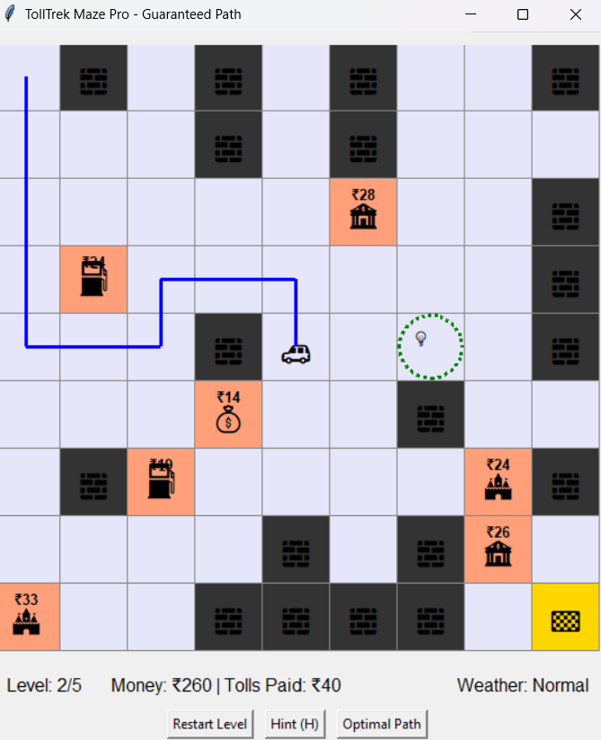

# TollTrek Maze Game 🚗💨



A strategic maze navigation game where you must reach the destination while paying tolls along the way. Plan your route carefully to minimize costs!

## Features ✨
- **Guaranteed solvable mazes** with at least 2 mandatory toll crossings
- **Smart hint system** that suggests optimal paths after 2-3 games
- **Dynamic weather system** affecting toll prices (☀️🌧️🌫️❄️)
- **5 progressive levels** with increasing difficulty
- **Visual path tracking** and cost calculation
- **Keyboard controls** (arrow keys) and hint hotkey (H)

## How to Play 🎮
1. Navigate from start (top-left) to destination (bottom-right)
2. Avoid walls (🧱) - they're impassable
3. Pay tolls (🏰/💰/🏦) when you cross them
4. Reach the 🏁 with enough money to win!
5. Press H for hints after playing 2-3 games

## Installation 💻
```bash
git clone https://github.com/your-username/TollTrek-Maze.git
cd TollTrek-Maze
python TollTrek_v5.py
